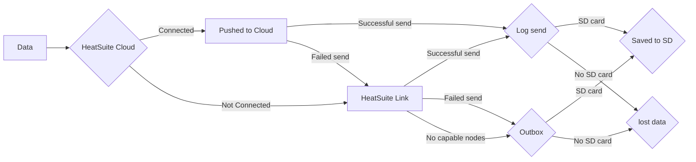

## Offline First

The HeatSuite system is built as an offline first solution, with all data collected being stored locally on an SD card. The SD card also serves as a data redundancy solution even if you pair your nodes with [HeatSuite Cloud](/docs/cloud/index.md) - which is highly encouraged to get the maximum useability of HeatSuite. However, not all nodes need an SD card, and that is where primary and satellite nodes come in. 

## Primary vs Satellite nodes

The key distinction between these nodes is how it can manage the data it collects. If the device has an SD card or is connected to a [HeatSuite Cloud](/docs/cloud/index.md) instance, it is defined as a primary node as it has *somewhere* to store data. A satellite node has no place to store data, and therefore is reliant on primary nodes to help handle the data it collects. This is where HeatSuite Link comes into play.

## HeatSuite Link

HeatSuite Link is the local device-to-device encrypted communication layer that lets nearby nodes exchange status, relay data, and coordinate updates when direct cloud connectivity is unavailable or less suitable. 

Each node periodically announces itself over a short-range radio link with basic readiness information and nearby nodes listen for those announcements. When a node cannot reach the server directly, or another nearby node is a better candidate with local storage (e.g. SD card), it can hand off its data. The receiving node can then forward that data through its own Wi-Fi or cellular connection, or hold it in local storage until transport is available.

## Schematic of data flow

Below is a simplified schematic of how data is sent through the HeatSuite ecosystem.

## Data from Bangle.js2 or other wearables

Up to now, all discussion has been focused on how data generated from a node is processed through the heatsuite ecosystem. Data stored on the Bangle.js2 can also be ingested within the HeatSuite ecosystem and processed on [HeatSuite Cloud](/docs/cloud/index.md). However, a Bangle.js2 will only send its data to a node that has an SD card, and at present no Bangle.js2 data is transfered over HeatSuite Link and can only be directly sent to [HeatSuite Cloud](/docs/cloud/index.md) - if the node is connected.
