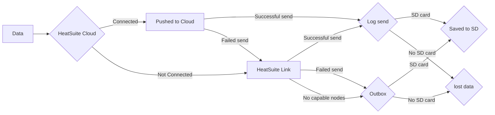

## Offline First

The HeatSuite system is built as an offline first solution, with all data collected being stored locally on an SD card. The SD card also serves as a data redundancy solution even if you pair your nodes with [HeatSuite Cloud](/docs/cloud/index.md) - which is highly encouraged to get the maximum useability of HeatSuite. However, not all nodes need an SD card, and that is where primary and satellite nodes come in. 


## Primary vs Secondary nodes

The key distinction between these nodes is how it can manage the data it collects. If the device has an SD card or is connected to a [HeatSuite Cloud](/docs/cloud/index.md) instance, it is defined as a primary node as it has *somewhere* to store data. A secondary node has no place to store data, and therefore is reliant on primary nodes to help handle the data it collects. This is where HeatSuite Link comes into play.

## HeatSuite Link

HeatSuite Link is the local device-to-device encrypted communication layer that lets nearby nodes exchange status, relay data, and coordinate updates when direct cloud connectivity is unavailable or less suitable. The HeatSuite Link is encrypted and unique to the [HeatSuite Cloud](/docs/cloud/index.md) deployment, which means multiple HeatSuite deployments can operate simultaneously in close proximity without conflict.

Each node periodically announces itself over a short-range radio link with basic readiness information and nearby nodes listen for those announcements. When a node cannot reach the server directly, or another nearby node is a better candidate with local storage (e.g. SD card), it can hand off its data. The receiving node can then forward that data through its own Wi-Fi or cellular connection, or hold it in local storage until transport is available.


## Schematic of data flow

Below is a simplified schematic of how data is sent through the HeatSuite ecosystem.



*Notes*: Outbox data is only sent directly to [HeatSuite Cloud](/docs/cloud/index.md), if the node is connected to an instance. 

## Data from Bangle.js2 or other wearables

Up to now, all discussion has been focused on how data generated from a node is processed through the heatsuite ecosystem. Data stored on the Bangle.js2 can also be ingested within the HeatSuite ecosystem and processed on [HeatSuite Cloud](/docs/cloud/index.md). However, a Bangle.js2 will only send its data to a node that has an SD card, and at present no Bangle.js2 data is transfered over HeatSuite Link and can only be directly sent to [HeatSuite Cloud](/docs/cloud/index.md) - if the node is connected.

## SD Card Data Management and Handling

*Note: Only SD Cards formatted as FAT32 are supported.*

The SD card is used as the device’s local data dedundancy and to keep a log of all data generated or received by a node, even if it is passed to [HeatSuite Cloud](/docs/cloud/index.md). The SD card and its management is designed to protect data from common problems during field deployment such as, power loss, Bluetooth disconnects, network failures. 

If you inspect the SD card and its data directories, you will see the following folders:

```text
/outbox
/failed
/delivered
/staging
/dev
/up
```

### Outbox, failed, and delivered

The `/outbox`, `/failed`, and `/delivered` folders are used for message handling.

The `/outbox` folder contains messages that the node has created or received over HeatSuite Link but has not successfully sent yet. This usually happens when the node is offline, the network is unstable, or the cloud connection is temporarily unavailable. Each message is saved as its own `.json` file so it can be retried later. 

A typical outbox file contains message details, followed by the actual message payload. For example:

```json
{"v":1,"msg_id":"00000042","topic":"telemetry","ts":1780579200,"crc32":305419896}
{"tags":{"sensor":"aht20","device":"heatsuite-node-01","kind":"air"},"fields":{"temp":22.6,"rh":41.2,"uptime_ms":153842},"ts_ms":1780579200123}
```

In this example:

- `msg_id` is the saved message’s unique ID.
- `topic` is the topic of the message.
- `ts` is the time the message was saved.
- `crc32` is a check value used to detect damaged payload data.
- `tags` describe where the reading came from.
- `fields` contain the actual sensor readings.
- `ts_ms` is the measurement timestamp in milliseconds, when the clock is available.

The `/failed` folder contains messages that could not be processed correctly. For example, a message may be moved here if it is damaged, incomplete, badly formatted, or fails validation. 

The `/delivered` folder contains a local archive of messages that were successfully delivered. These are stored in daily log files using the format, for example:

```text
/delivered/delivered-2026-06-04.ndjson
```

Each line in a delivered log file is one delivered message record. This gives the node a local history of what was successfully passed along, whether this was sent through HeatSuite Link or to [HeatSuite Cloud](/docs/cloud/index.md).

### Staging, dev, up

The `/staging`, `/dev`, and `/up` folders are used for larger synced files, especially files received from wearable devices.

The `/staging` folder is a temporary holding area. When a wearable file is being copied to the SD card, it is first written here. The file stays in staging until the full transfer finishes successfully. If the transfer is interrupted by a Bluetooth disconnect, timeout, power loss, or write error, the partial file is deleted or left out of the final data area.

The `/dev` folder contains completed files that were received from devices and are waiting to be uploaded. For Bangle.js2 wearables, files are stored by device type and devices unique MAC address:

```text
/dev/banglejs2/<device-mac>/<timestamp>-<filename>
```

For example:

```text
/dev/banglejs2/AABBCCDDEEFF/1780579200-session.csv
```

The `/up` folder contains files that have already been uploaded successfully via HeatSuite Cloud. As of Firmware V2.0.9, these larger files are not transmitted over HeatSuite Link. After the [HeatSuite Cloud](/docs/cloud/index.md) instance confirms that a file has been received, the node moves it from `/dev` into the matching path under `/up` for long term storage.

For example, a completed upload may move from:

```text
/dev/banglejs2/AABBCCDDEEFF/1780579200-session.csv
```

to:

```text
/up/dev/banglejs2/AABBCCDDEEFF/1780579200-session.csv
```