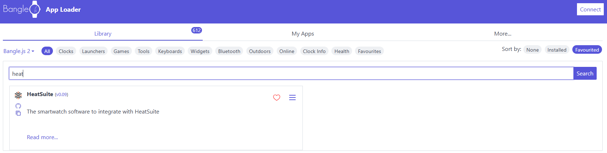
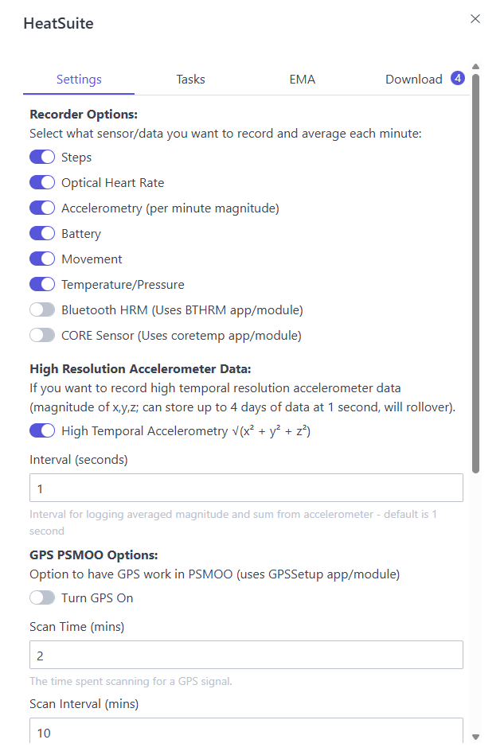
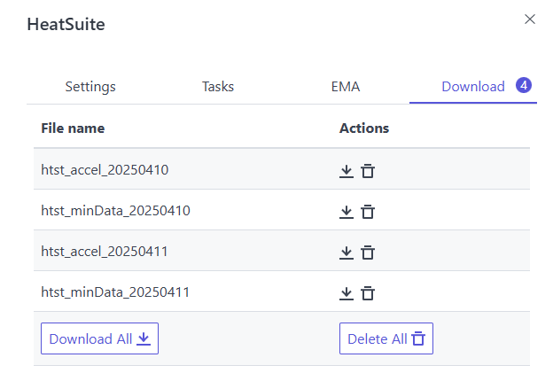

## Installing the Watch App

To install HeatSuite on the Bangle.js2, you can use either the primary [Bangle.js2 App Loader](https://banglejs.com/apps) for stable releases, or the [HeatSuiteLabs version](https://heatsuitelabs.github.io/BangleApps/) for pre-release/experimental features. 

Search for the HeatSuite app:

Then click the &equiv; to open the app customizer. You will need to connect to the Bangle.js2 watch to access the app customizer as some settings will be taken from the watch if HeatSuite was previously installed.

Each of the tabs contain settings you can set for the application, including [Tasks](watchapp-tasks.md) and [Ecological Momentary Assessments](watchapp-ema.md). Once you are satisfied with your settings, click "upload" at the bottom of the window. 

## Downloading Data

While the easiest route for downloading data is by pairing it with a HeatSuite Main Node, You can use the watch independently and download HeatSuite specific data files from the BangleApps site by clicking the Download Tab:

You can download each file separately, or all of them as a zip file.