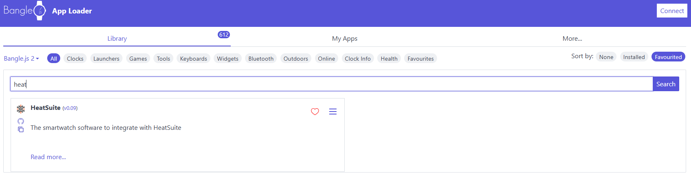
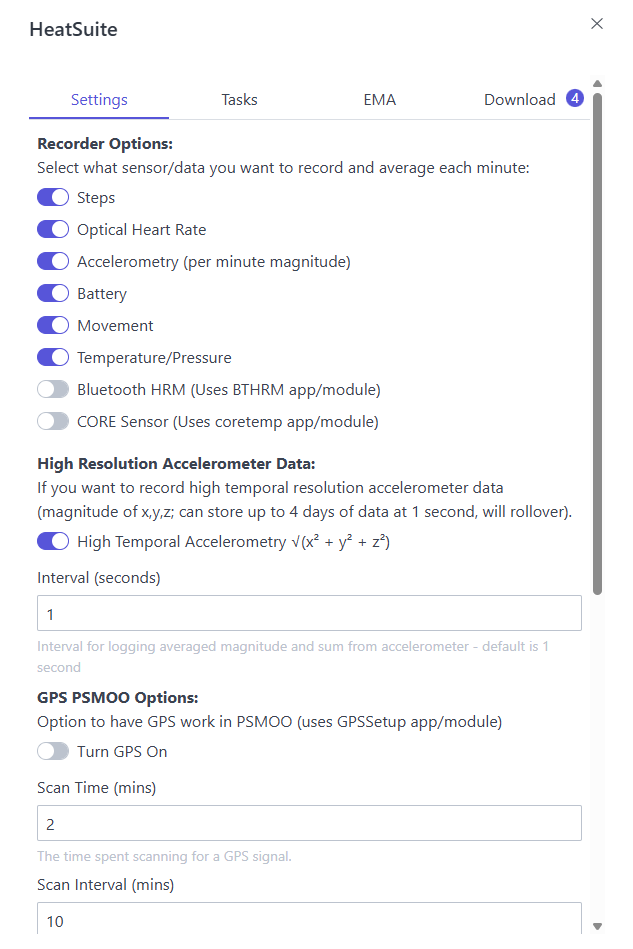
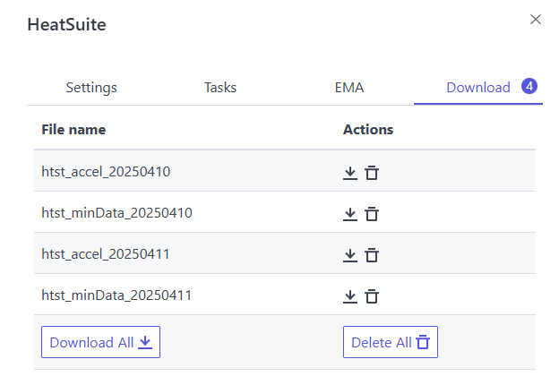

## Installing the Watch App

To install HeatSuite on the Bangle.js2, you can use either the primary [Bangle.js2 App Loader](https://banglejs.com/apps) for stable releases, or the [HeatSuiteLabs version](https://heatsuitelabs.github.io/BangleApps/) for pre-release/experimental features. 

Search for the HeatSuite app:

Then click the &equiv; to open the app customizer. You will need to connect to the Bangle.js2 watch to access the app customizer as some settings will be taken from the watch if HeatSuite was previously installed.

Each of the tabs contain settings you can set for the application, including [Tasks](watchapp-tasks.md) and [Ecological Momentary Assessments](watchapp-ema.md). Once you are satisfied with your settings, click "upload" at the bottom of the window. 

## Pairing a CORE/CALERA Sensor

The CORE Sensor is a device which indirectly estimates core body temperature using a heat flux sensor (read more about it [here](https://corebodytemp.com/pages/core-sensor-technology)) and can measure skin temperature. The onboard proprietary algorithm has two modes, free-living and exertional, where exertional only engages when heart rate exceeds 120 BPM, and requires the pairing of an ANT+ or Bluetooth Heart Rate Strap to the CORE Sensor. While I will not comment on the validity and reliability of the GreenTEG solution for estimating core body temperature (you can read other [validation studies](https://scholar.google.ca/scholar?hl=en&as_sdt=0%2C5&q=%28%22CORE+Sensor%22+OR+%22CALERA%22%29+%26%26+%22GreenTEG%22&btnG=) for specific use cases), I included it in HeatSuite for skin temperature and heat flux monitoring ([CALERA](https://info.greenteg.com/calera-research) version is only capable of broadcasting heat flux - likely firmware locked on the CORE). Pairing the CORE/CALERA Sensor with the Bangle.js2 uses the [coretemp app](https://github.com/espruino/BangleApps/tree/master/apps/coretemp) available from the Bangle.js App Loader. 

Follow these instructions on the watch to pair a CORE/CALERA Sensor:

1. Navigate to `Settings->Apps->CoreTemp`
2. Click `Scan for CORE` , which will scan for nearby CORE/CALERA devices. If your device is not found, shake it until the green LED flashes.
3. After the scan, you should be presented with a list of found devices. Click the one you want to pair to the watch.
4. The pairing process will start and should return successful. If not, repeat scan.

After you pair the CORE/CALERA Sensor, you will be prompted to pair a heart rate strap over ANT+. We use ANT+ instead of Bluetooth as chest-based HRM devices with both ANT+/BLE enable simultaneous broadcasting. Using ANT+ here allows you to also connect the strap over BLE to the watch to collect RR-intervals, too. 

To pair an ANT+ HRM:

5. Continue after your successful pairing of the CORE Sensor, or navigate to `Settings->Apps->CoreTemp->HRM Settings`
6. Click `Scan for ANT+`. This will scan for 10 seconds to find nearby ANT+ HR devices. 
7. The first one in the list should be the nearest device, so click its ID and it will begin to pair.

*__Note:__ I recommend enabling the CORE Sensor Widget to monitor its connection. The widget will glow green when connected to the Bangle.js2.*

*__Note:__ Pairing a CORE/CALERA Sensor does not automatically have it log data within HeatSuite, you must also enable CORE Sensor as a 'Recorder option' of HeatSuite; either within the App Loader Screen or on the watch within HeatSuite Settings.*

## Downloading Data

While the easiest route for downloading data is by pairing it with a HeatSuite Primary Node, You can use the watch independently and download HeatSuite specific data files from the BangleApps site by clicking the Download Tab:

You can download each file separately, or all of them as a zip file.