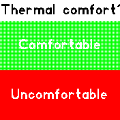

# HeatSuite Watch App - Ecological Momentary Assessments

## What are Ecological Momentary Assessments (aka EMA)?

Ecological Momentary Assessment (EMA) is a research method that involves collecting data about an individuals' behaviors, experiences, emotions, or physiological states in real time and in their natural environments. This method enables the collection of *"right here, right now"* data whereby users respond to questions directly on the watch.

## What questions can I ask?

Short answer, anything! As HeatSuite was designed to be a researcher first tool, it does not come with pre-defined questions. You are in full control of what questions you want to ask, and their design - within the limits of the software. In brief, the best questions are short with simple responses (one/two words per option).

## How do I add EMA questions? 

Adding EMA to the watch app requires you to simply upload a properly formatted heatsuite.survey.json file to the watch. This is done during the HeatSuite app installation on the Bangle.js2. If you want to add in additional programmatic "nudging", you will need to include the survey task in your heatsuite.tasks.json file ([how do I do that?](watchapp-tasks.md)).

## Formatting heatsuite.survey.json

Below is an example of a heatsuite.survey.json file with one question, with two available languages that you can use to build your EMA questions from:

```json
{
"supported":{
    "en_GB":"English (GB)",
    "fr_CA":"Francais (CA)"
    },
"questions":[{
    "key":"comfort",
    "followup": false,
    "text": {
        "en_GB":"Thermal comfort?",
        "fr_CA":"Confort thermique?"
        },
    "tod":[[0,2359]],
    "oncePerDay": true,
    "orderFix":false,
    "options": { 
        "type" : "scroll",
        "responses": [{
                "text":{
                    "en_GB":"Comfortable",
                    "fr_CA":"Confortable"
                    },
                "value":0,
                "color":"#ffffff",
                "btnColor":"#38ed35"
                },{
                "text":{
                    "en_GB":"Uncomfortable",
                    "fr_CA": "Inconfortable"
                    },
                "value":1,
                "color":"#ffffff",
                "btnColor":"#ff0019",
                "next": "uc_reason"
                }]
        }
    }]
}
```
And this will present us with this question on the watch (the top text is scrolling if it does not fit on screen):



Lets break it down:
```json
"supported":{
    "en_GB":"English (GB)",
    "fr_CA":"Francais (CA)"
    }
```
`supported` is object `{}` which contains all supported languages for your EMA. You must include all supported languages here as `key:value` with the key being the identifier (e.g. `en_GB`) and the value being the descriptor (e.g. `English (GB)`). The user will be able to select their prefered language within `Settings->Apps->HeatSuite`. HeatSuite recommends following the language convention used within [BangleApps locales.js](https://github.com/espruino/BangleApps/blob/master/apps/locale/locales.js).
```json
"questions":[]
```
`questions` will contain an array `[]` of objects `{}`. Within each object is the details and settings of your question. Below is what a question object would look like:

```json
{
    "key":"comfort",
    "followup": false,
    "text": {
        "en_GB":"Thermal comfort?",
        "fr_CA":"Confort thermique?"
        },
    "tod":[[0,2359]],
    "oncePerDay": true,
    "orderFix":false,
    "options": { 
        "type" : "scroll",
        "responses": [{
                "text":{
                    "en_GB":"Comfortable",
                    "fr_CA":"Confortable"
                    },
                "value":0,
                "color":"#ffffff",
                "btnColor":"#38ed35"
                },{
                "text":{
                    "en_GB":"Uncomfortable",
                    "fr_CA": "Inconfortable"
                    },
                "value":1,
                "color":"#ffffff",
                "btnColor":"#ff0019",
                "next": "uc_reason"
                }]
        }
}
```

* `key`: The definition/classification you want to give this question
* `followup` (optional, default is false): This labels a question as a follow up question. You can use this to create questions that are asked only when a given response is received.
* `text`: an object `{}` containing the question/prompt with keys corresponding to all supported languages and values containing the text to be presented.
* `tod`(optional): an array `[]` of arrays `[]` containing possible restrictions of the question depending on time of day (in 24h clock). Within this example, The question may be presented at any time of day (`[0,2359]`). However, if you want to restrict the question to only be visible in the morning, you would adjust to `[0,1159]`. If you only want questions to be restricted to specific times of day, you can add multiple time windows in the array like this: `"tod":[[0,1159],[1400,1800]]`. In this example, you will only see the question between 00:00 & 11:59, or 14:00 & 18:00.  
* `oncePerDay`(optional): a boolean value (`true` or `false`) to restrict the question to only appear once a day.
* `orderFix` (optional): a boolean value (`true` or `false`) to fix the order of this question if you have selected question randomization in HeatSuite settings.

## Formatting your options object for different response types

With HeatSuite watch app **v0.12** and above, you now have the option to chose between  scrolling through responses or a numerical based response. Each uses the same `options` object `{}`, but with different settings. See below:

* `options`: an object `{}` containing the following keys:
    * `type`: A string defining the type of response style to generate (`number` or `scroll`)
    * `startOpt` (required for `number` type): The value you want presented first.
    * `min` (required for `number` type): The smallest value that can be selected.
    * `max` (required for `number` type): The highest value that can be selected.
    * `optStep` (required for `number` type): The step between values (e.g. 1 unit increments would be 1).
    * `units` (optional): To append to the visible response.
    * `next` (optional, ignored if responses is used): An object `{}` containing the specific response id as `keys`, where their `value` is the the key of the follow up question.
    * `responses` (required for `scroll` type): An array `[]` of objects `{}` containing details for each option to present for the user to select. Within each object, you have the following options:
        * `text`: object `{}` containing your language specific (key) option text (value).
        * `value`: the numerical value you wish for response coding.
        * `color`: The color of the option text.
        * `btnColor`: The color of the option background.
        * `next` (optional): the unique `key` of the follow up question. When this option is pressed, this will present the user the defined follow up question. **

**Notes on `next` option: This allows for more detailed responses and feedback. You can even iterate this 'next' feature to keep asking the same question over and over, or nest multiple follow up questions depending on response.
