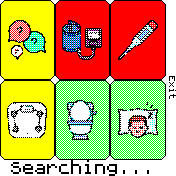

# HeatSuite Watch App - Tasks

## What are tasks?

Similar to the question-based [ecological momentary assessments](watchapp-ema.md), you can also add tasks to your HeatSuite install for users to perform. The data collected from these tasks will automatically save to the watches internal storage for future downloading.

## How do I add tasks in my study?

The custom Bangle.js App Uploader for HeatSuite includes a json editor for detailing tasks which are uploaded to the watch as a `heatsuite.tasks.json` file. Tasks and their options are organized as nested objects `{}` within an array `[]`.

## How do I see the tasks in my study on the watch?
Simply onlock the screen and swipe right when the widget is active and you will be greeted with the main Heatsuite App:



This is the default setup, showing you all the possible options at present. The colors of each of the buttons provide the user some feedback:

+ <font color="green">Green</font> Means the task has been completed recently and/or the user can press the button to navigate to or do a task*.
+  <font color="red">Red</font> means that the task can't be completed yet because another step needs to be done. This example shows that the external devices have yet to be paired with the watch.
+ <font color="yellow">Yellow</font> means you are scheduled to do this task.

_*Note: If the task requires a bluetooth device, the app will scan for the device and automatically handle the task once found._

The `Searching...` text at the bottom of the screen shows that the watch is searching for devices that it may need to connect to via Bluetooth. This text will change when a device is found, and the appropriate handling of the task will ensue. As Bluetooth scanning drains the battery, the HeatSuite App will timeout after 3 minutes and revert back to the clock.

_Note: This will only show when a bluetooth device is associated with a task._

## Formatting heatsuite.tasks.json

Below is an example of a properly formatted `heatsuite.tasks.json` with 2 tasks (survey & Blood Pressure):

```json
[
    {
        "id": "survey",
        "icon": 'require("heatshrink").decompress(atob("lEo4kA///6H7BIP2m9hjEpyQLBxeq0UAp3js1Z5F59GB9nChvL+83E4cCkQABkA6NgUq293rVCChsq6MRAAOcoQmM4ISCAAPqFBclCQkRjJpBExOxCYsR8goJkmRB4XuAYUVCZMsJYdEFgUZoATIpwTC1XnooFC2QTIoIhCC4OqCYVyMRGhBoXhjNLAoXSCZkR2mpAgXilGIwRnFCYlKPgd40czmeoCglJCYd5AgdYn////zCgknBwfZAgeqCQIUCwQTClQOD3oDCj1DCYf/nATHAAcawYTE/Q8CkoTHvE/+c6mY8FMYgACi9Kn84xAqDmSfC7euCYnE0f/1CKBPQRQBgWqkUk3zeCvWKBwJ4BnATFKQUipWq0koBoSyBxATDZYsCkUAOgk4AoYTGAAUjCYgmCUAgAFlQTDRQQTGgUowQuBJ4f/nQEDRYIiD81u0UAhAODmYECeAkCq1ms1nkECbIoACD4ImCCQIAB2QGBFAYADHYchs3nv1msguBY4IAD+bhBCYVGs261YTCMovz1GKnSfCCYIACtRXCxTHBeAJYBxGACYek8wnDSYWIxAjCdocls0eE4PiXhAAEhEWCQNhoATNgFOCYPkCRxABpdqIQQUP2gSQCYMiCaMAHRw="))',
        "cbBtn": "Bangle.load('heatsuite.survey.js');",
        "tod": [
          900,
          1200,
          1500,
          1800
        ],
        "debounce": 300
    },{
        "id": "bloodPressure",
        "icon": 'require("heatshrink").decompress(atob("lEo4kA///zND//3BYOe98ggHGhEllM533ssW5odBhFOud642DhE10omCnczHSO3s3jmATP3MRjNrCh+2s0ZzNrCJkDn1mv1382X8YlMyMRi1xy1hzwSKhdxs12CYIWBu5RKm8WtMeCYfp8ATJ2MRiITDjPpsCUCu4ADv2w24TBjITCiOZE4MLCQgABve+MQMXCYeW2ATBv2ZAAeeve28w7Ey3mE4dCkQACx172INBtd+s1m81xJ4ITBpH/wn//oTB29pjIRBs1nAgITD7l3zGXv4nDsJRBiORz1hCYdCogBCCYWhiNusNutIWByA7EKIXXCYOq1QPBAAIZBiA7DvITCp4TDAAYTBHYp3CpgTNxvdAAX+CZl+9wAECZjDBbIQEBCZwlC9ITOy98zOcFAITOzl+vgTQvJSCJ6QWBCYMaCZED852CAAXj21pCgkRswTBgEzmc78/rAgMwm1usLvDz1m2ATBAAMD5+TAodpiIVBt3njN+CYvn8YGDnwnEu18uAMDgHpDQkAnfms1mtc+/4TFvngAwgxCAQV3EAt8AwoWFvIMF5gTKgF/HYv5mATKnPLAoc3+4TLh3J8ayCvieDKBN85LVBznJJxaSCvPM5nJuYSMCgW73ezBIoA="))',
        "tod": [
          830,
          1330,
          1930
        ],
        "debounce": 3600,
        "btPair": true,
        "btInfo": {
          "service": "1810",
          "supported": [
            "A&D_UA-651"
          ]
        },
        "options":{}
    }
]
```
Lets break it down for the `Blood Pressure` task:

+ `id`: The identifier for the task. This is what is used in the cache file to associate the last reading with the task. must be unique.
+ `icon`: This is a single quote encapsulated javascript function, which will be passed through the `eval()` function to render an image in the button. For immediately available tasks, HeatSuite provides icons, but you are free to change them as you wish. You can use [Espruino's Image Converter](https://www.espruino.com/Image+Converter) to generate the javascript function. Recommended settings include: Compression, transparent, and 40x40 px in size.
+ `tod`: (optional) An array of times of day (in HHMM) when the user will be notified that they need to do task(s).
+ `debounce`: (optional) This is the range, in seconds, whereby a notification will not be sent if the task was completed within that time frame of the nudge.
+ `btPair`: (optional) Required for any devices that must be paired before communication.
+ `btInfo`: (optional) Contains an object `{}` with details about the bluetooth device and what filters are needed for a connection.
+ `options`: (optional) Task-specific options that can be defined to modify the task.

## What tasks are immediately available?

In the current HeatSuite Watch App version, the following tasks have already been embedded and examples are provided for inclusion in the `heatsuite.tasks.json` file:

- [Blood Pressure](#blood-pressure) (requires A&D Medical UA651-BLE)
- [Oral Temperature](#oral-temperature) (requires custom BLE dongle)
- [Body Composition](#body-composition) (requires Xiaomi Mi Scale 2)
- [Mictruition](#mictruition)
- [Ecological Momentary Assessments](#ecological-momentary-assessments)
- [5x Sit To Stand](#5x-sit-to-stand)
- [Custom Tasks](#custom-tasks)

### Blood Pressure

Example task object for blood pressure measurements using the [A&D Medical UA651-BLE](https://medical.andonline.com/product/premium-blood-pressure-monitor-ua-651ble/):

```json
{
    "id": "bloodPressure",
    "icon": 'require("heatshrink").decompress(atob("lEo4kA///zND//3BYOe98ggHGhEllM533ssW5odBhFOud642DhE10omCnczHSO3s3jmATP3MRjNrCh+2s0ZzNrCJkDn1mv1382X8YlMyMRi1xy1hzwSKhdxs12CYIWBu5RKm8WtMeCYfp8ATJ2MRiITDjPpsCUCu4ADv2w24TBjITCiOZE4MLCQgABve+MQMXCYeW2ATBv2ZAAeeve28w7Ey3mE4dCkQACx172INBtd+s1m81xJ4ITBpH/wn//oTB29pjIRBs1nAgITD7l3zGXv4nDsJRBiORz1hCYdCogBCCYWhiNusNutIWByA7EKIXXCYOq1QPBAAIZBiA7DvITCp4TDAAYTBHYp3CpgTNxvdAAX+CZl+9wAECZjDBbIQEBCZwlC9ITOy98zOcFAITOzl+vgTQvJSCJ6QWBCYMaCZED852CAAXj21pCgkRswTBgEzmc78/rAgMwm1usLvDz1m2ATBAAMD5+TAodpiIVBt3njN+CYvn8YGDnwnEu18uAMDgHpDQkAnfms1mtc+/4TFvngAwgxCAQV3EAt8AwoWFvIMF5gTKgF/HYv5mATKnPLAoc3+4TLh3J8ayCvieDKBN85LVBznJJxaSCvPM5nJuYSMCgW73ezBIoA="))',
    "tod": [830,1330,1930],
    "debounce": 3600,
    "btPair": true,
    "btInfo": {
        "service": "1810",
        "supported": ["A&D_UA-651"]
    }
}
```
### Oral Temperature

Example task object for oral temperature measurements using a custom Bluetooth dongle interfacing with a YSI-400 series probe (contact [Nick Ravanelli](mailto:nick.ravanelli@gmail.com) for more details):

```json
{
    "id": "coreTemperature",
    "icon": 'require("heatshrink").decompress(atob("lEo4kA///A4Pf99fx3YtnjjEkkN/7+X0ujoFK/VusdBhH0ykIoXY2ozPjnBIyEBr2piATPiuq1WREx9aCYIoPjmaCYIoOgNo9ITC1gTMi3yvwoC9gmNw8nFAVRExmL5dyFAOlMZcBt+2223FAImN+9Emlru/cExlo6kzme8x9hJptkmYnBwwmN21DmdG3Am/TZF28YmPgvyl9rEx0AjsikX28wmNgFnkVyFAImNgHnl7pBvAmNgOyk/3u/2ExsM6UiEx8Ajd3u9/6omNgO3u/b8wSNgEeu974IRNEwPvu+xCRzrB+/+HBwABrF/8ISPhnXYBwAC5t9qImQ2/cCR8Ajm32ASPgPr5YmQj3eMCEB9qHQEycA5wmROoImRgAA=="))',
    "tod": [830,1330,1930],
    "debounce": 3600,
    "btPair": true,
    "btInfo": {
        "service": "1809",
        "supported": ["BLEThermistorPod"]
    }
}
```

### Body Composition

Example task object for body composition using the [Xiaomi Body Composition Scale 2](https://www.mi.com/global/product/mi-smart-scale-2/)
```json
{
    "id": "bodyMass",
    "icon": "require('heatshrink').decompress(atob('lEo4kB3//AAIJB7//wUQjnn485t97vvvoMIhlj9dasspptbz33kshiIApkUpylP/nGswAB5n/pOSkQSEl+3utVAAOI93uxAGCq96+QSCil1gczABdXyITBo4SDmt6ut61Wq09TBQU+ukRiVwDgcK5t1vvd7vc0ALD88hjgbDmcLvxOBAAOH2ALDgvBk5EEq1+wpfBrGHsoLDh1yyouEtN+q3M5llw+WvwMCgF5CYMFu9V3l2E4tn5dVu9Qh1ZCYN0/9E2s65phBMYWjrdE/9HCYOXmv2u9kqaLBRIKLDmtLu9vqF5y83o930lzWA83+4MCvMnmtKCZYgB2lQuQTBtmr5ijEAAc15mr+1euUqTYNESwgAFBgUO0Urgc+uwmIFAVn8fu2UW8czu2DCZM4s8z9FhCYVcE5fFmflsMcCAITP4MfCaPxigQB8yeIUAVumHloMZCYMLCZewCYORCYU32YTJndzCYUSEgM34p7BAA0+rgTBg8hCYM+ulE2oTHrdEo/g84TCmvLvdHgYSFmF009kuYTEu93tiNGDwN3vm+CYWjm9nCZvqkMR2E3pV6pQ7H1932lw9cRiNonGk+llMY9Wp9KwFWCYNFZgN3HQflrw8Du9emFUCYMqG41cdIIAEh2yCYMUbI1VqpSF89BCYMRo7FIAAc4ugSCiMZ2tY9wAGn3uwt7yITDiMp+1mAAtqrVmt+SCQgAl'))",
    "tod": [800],
    "debounce": 3600,
    "btPair": false,
    "btInfo": {
        "service": "181b",
        "supported": ["MIBFS"]
    }
}
```
### Mictruition
Example task object for the micruition feature which can be used to record urination frequency (indirect assessment of hydration [Burchfield et al. 2015](https://doi.org/10.1038/ejcn.2014.278)), and subjective ratings of flow rate and urine color.

```json
{
    "id": "urine",
    "icon": "require('heatshrink').decompress(atob('lEo4kA///7/3oMInGVtdC//3rvn5lS7/Gx1rksZDYIXB7edkAFB4wqGhcukXgHp0Lkkz6eaCheykWq9Ux5nM42elWilwjH0c97VG5lVqtcjOp7s3JwIAEgU4xF6tgSBAAPBzXf/FACYsK7GD1vFCYdcjuIx+bCY/azgSDAANRyePzwTHzQ6EAAWax87CY2Z1I6EHgVqvNyMY0q1ATGqsX1XrRg1JoITH4dJRY0Ao5iGAAPN1MkogVFogTI42p1uIUItEngTJ0lE0AnQle7J59d1JjHoemO4/JoYTHpGjWZGTCY9BzWMCYvBzVjCZFn1tc5gADtOtqewCY2py/qvOZAAeu1OUCY0LSYN3ogAEo90Yo0AgU4xAAJYooTBzvdABLFFAAMq1QAJMY+0ExMyCQ0AgkRjiKEAAQTIhVhirbGrmeCY8C6MRCY1VvYTHhwTI4x2HAANhCY/Ndw4AB0YTG5mERQ5QCods5nFrnM4Np1YSIAAOy1PWiMRtE31wSKgEL0mq0lEAQJNJHgc96c5zM9xFLCZcE7GPAAP4x7FIAAe5xGP/4AC7QTLlMzAAk0RRIAB8UiAAkuCYwA=='))",
    "cbBtn": "Bangle.load('heatsuite.urine.js');",
    "debounce": 0,
    "tod": [],
    "options": {
        "alwaysColor" : false //Always show the color scale when logging mictruition. Default is false.
    }
}
```

### Ecological Momentary Assessments

Example task object for Ecological Momentary Assessments where you want to programmatically nudge participants at fixed times of day. Requires a properly formatted `heatsuite.survey.json` file, which is [explained here](/docs/watchapp/watchapp-ema.md).

*NOTE*: This is not required if all you want to do is have surveys completed from a different queuing mechanism. 

```json
{
    "id": "survey",
    "icon": 'require("heatshrink").decompress(atob("lEo4kA///6H7BIP2m9hjEpyQLBxeq0UAp3js1Z5F59GB9nChvL+83E4cCkQABkA6NgUq293rVCChsq6MRAAOcoQmM4ISCAAPqFBclCQkRjJpBExOxCYsR8goJkmRB4XuAYUVCZMsJYdEFgUZoATIpwTC1XnooFC2QTIoIhCC4OqCYVyMRGhBoXhjNLAoXSCZkR2mpAgXilGIwRnFCYlKPgd40czmeoCglJCYd5AgdYn////zCgknBwfZAgeqCQIUCwQTClQOD3oDCj1DCYf/nATHAAcawYTE/Q8CkoTHvE/+c6mY8FMYgACi9Kn84xAqDmSfC7euCYnE0f/1CKBPQRQBgWqkUk3zeCvWKBwJ4BnATFKQUipWq0koBoSyBxATDZYsCkUAOgk4AoYTGAAUjCYgmCUAgAFlQTDRQQTGgUowQuBJ4f/nQEDRYIiD81u0UAhAODmYECeAkCq1ms1nkECbIoACD4ImCCQIAB2QGBFAYADHYchs3nv1msguBY4IAD+bhBCYVGs261YTCMovz1GKnSfCCYIACtRXCxTHBeAJYBxGACYek8wnDSYWIxAjCdocls0eE4PiXhAAEhEWCQNhoATNgFOCYPkCRxABpdqIQQUP2gSQCYMiCaMAHRw="))',
    "cbBtn": "Bangle.load('heatsuite.survey.js');",
    "tod": [900,1200,1500,1800],
    "debounce": 300
}
```

### 5x Sit to Stand

The **Five Times Sit-to-Stand Test (5xSTS)** is a simple functional assessment used to evaluate lower limb strength, balance, and mobility. In this test, participants sit in a standard-height chair without armrests, cross their arms over their chest, and are instructed to stand up and sit down five times as quickly and safely as possible. The total time taken to complete the five repetitions is recorded. The test provides an objective measure of functional lower-body performance and is widely used in clinical, geriatric, and exercise physiology settings.

*NOTE*: Validation ongoing - use at your own risk.

```json
{
    "id": "5sts",
    "icon": 'require("heatshrink").decompress(atob("lEo4kA///A4PTzkv/8fp/tjWCBoNGw+DrlGh0b9WsFZ8RiMQCR8BCYMREyEzmYoPgMTCYMxCaQoBCcs4HZ5jCJ553Bic7UCCfTCgLGQAAQTRHYQUQiMZoLvRolEoIoNBoMUCZ5MBgITQiMhiIT/CfbeMCZDeKCYoAC0IoJCZBSKCYMQiITRJQQACFgJQJCY4sBCZcSkQABIAYnPCYehCaEBihkJBwQEECc8AixkJCZB4KCakRCYYECgIEBCY4KBAgwDBMYg="));',
    "tod": [900],
    "debounce": 300
}
```

### Custom Tasks

A unique feature to HeatSuite is the ability for researchers to create their own tasks and add them to the task object. Lets create a sleep marker where when users press the onscreen button, it will log an event marker. here is an example task object:

```json
{
    "id": "sleep",
    "icon": "require('heatshrink').decompress(atob('lEo4kA///v3nBIPDjE968CqOzxlX/1m0VBhGBkHb61qpV4/0978Y2xZ1gQTmkQ9VkA9llJKMJZMjmRADlM85gAC4eSBYUCCIOW23Mmc281v30RAAXr+wLBmfMt9py0Rj27CAgAEBYIMCtMsB5AAE///33u4UD2ISLjfMnNu9cwhPxE5nr5m+9+QgVhBYhpBAAVrA4Mcn/ui0gCYsWnVVAANa0YLBsfxCZFjrGIAAWFm0fRQP+CY0fmoSDAANT/dmswTCMYkc1ATFxXBUIPuMYMDCYfsquqAAOlxGqqs7CYcwT4mzqfGGgNmu9onQTB93uT4ITFzHdAAd3xM/CYo7D2eWCYtpCYY7BMYgTNY4vzCY1jz4TCT4r5Bs92v996/3AoPM2J3BCYsfm/duvDtvWnk3u9z+ITIm3d63IE4Nss48BCYhjE5l9J4t35jHFT4fzr/dJoJRBu9lO4ITBT4MsNAPhHgPM7vfnnD/t3wf+8ITB93Cy0R9e//exspNBtGGHQQLC30RtOW+3Mmcz5/ztpOC692ngLC5lvtMjmUggAABhh5BWQciBYUCCIIQCAAcjs4SBuwMHAA+V42MrISOAAMikQSQAD4='))",
    "cbBtn": 'modHS.saveDataToFile("sleep", "marker", {"event":"sleep"});Bangle.showClock();',
    "debounce": 0,
    "tod": [],
}
```
This onscreen button returns customized javascript code that is encapsulated in quotations within the callback button key (`cbBtn`):

```javascript
modHS.saveDataToFile("sleep", "marker", {"event":"sleep"});
Bangle.showClock();
```

This first uses the `saveDataToFile()` function the HeatSuite Module (`modHS`) with three pieces of information:
```
("sleep", "marker", {"event":"sleep"})
```

+ The first item, `"sleep"` must match the id of the task.
+ The second item, `"marker"` is the file identifier for where the data is stored.
+ The third item is the `data` that is to be stored, in an object format. The object contains the keys and values, whereby the keys will represent the column headers. If you wish to have multiple tasks store to the same file, you must declare all the possible keys in every custom task!

These two lines of code do the following: 

On button press, a "sleep" event marker will be saved to the file: `htst_marker_DDMMYYYY` on the watch and give the following headers to the csv format: `unix,tz,event` (uniz and tz[timezone] are automatically prepended to the headers).
